# Better Go to Line/Column

`Ctrl+G` command box: everything the built-in Go to Line/Column does, plus Vim motions, operators
and ex commands. One command, one `Enter`.

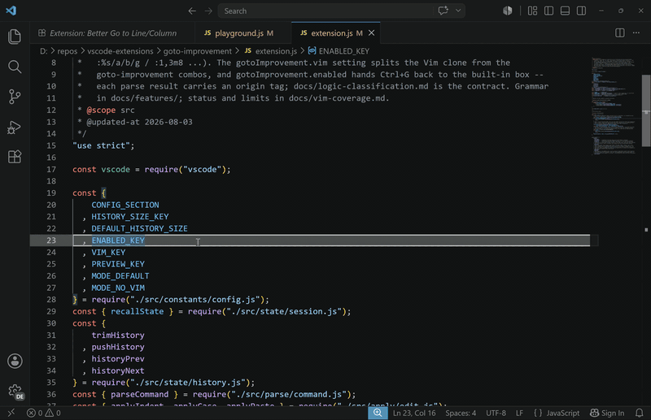

- **Install:** [Marketplace](https://marketplace.visualstudio.com/items?itemName=meo658.better-goto), or search "Better Go to Line" in the VS Code Extensions view
- **Bugs:** [Issues](https://github.com/Trick-Lor/vscode-better-goto-extension/issues) -- say what you typed, where the cursor was, what happened
- **Contribute:** [CONTRIBUTING.md](CONTRIBUTING.md)
- **Privacy:** collects nothing, no network ([privacy.md](privacy.md))

## In action

A few commands, one per clip. Pairs show the two directions of the same command.

| `+5` -- 5 lines down | `-5` -- 5 lines up |
| --- | --- |
| 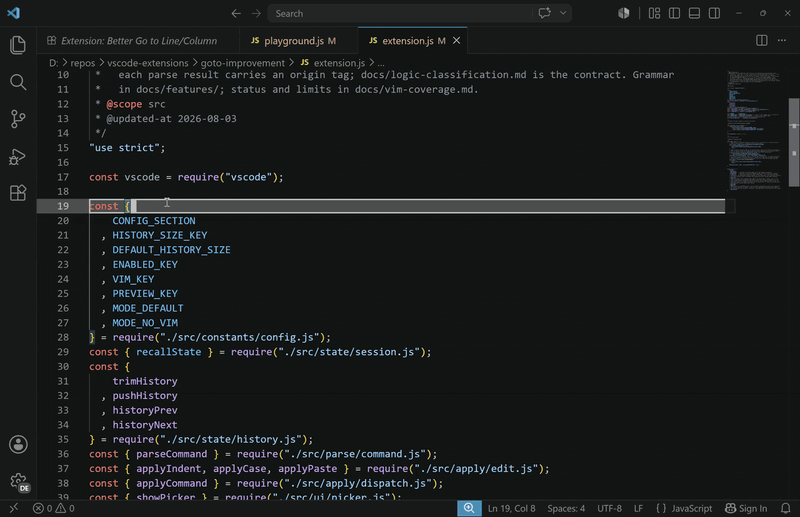 | 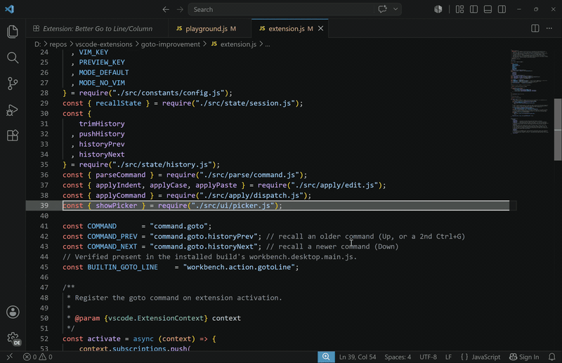 |

| `12j` -- 12 lines down | `12k` -- 12 lines up |
| --- | --- |
| 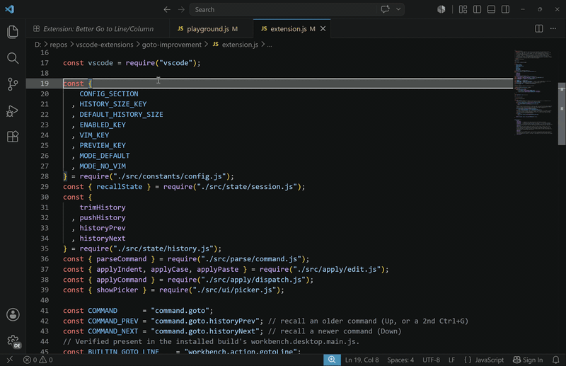 | 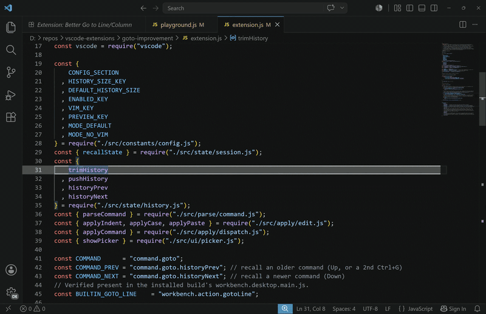 |

| `guiw` -- lowercase the word | `gUiw` -- uppercase the word |
| --- | --- |
| 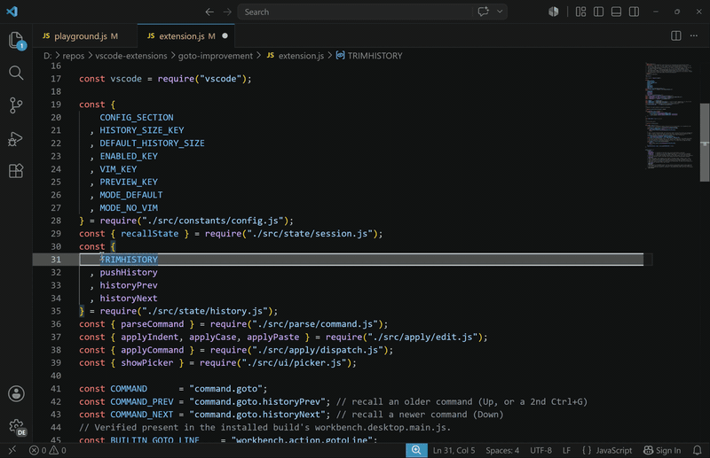 | 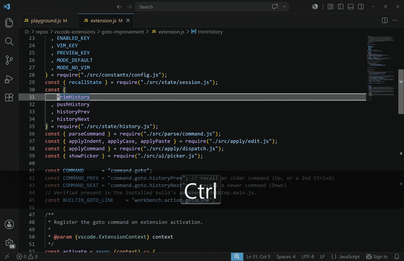 |

| `ciw` -- change the word under the cursor | `diw` -- delete the word under the cursor |
| --- | --- |
| 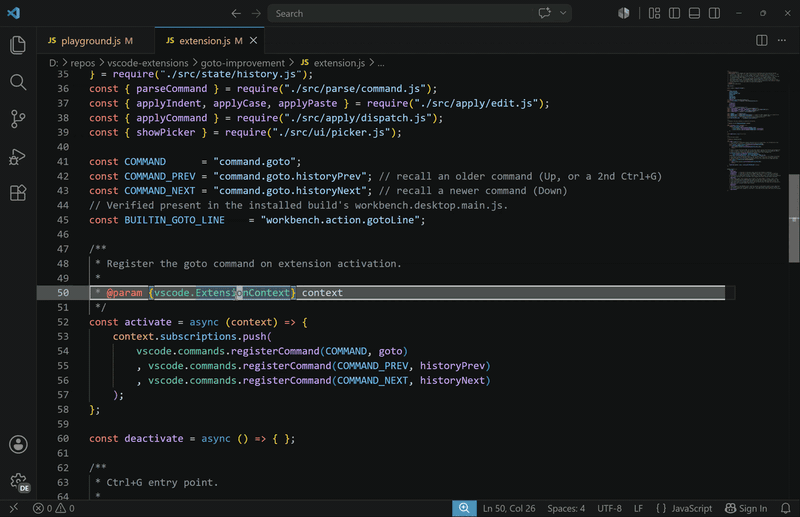 | 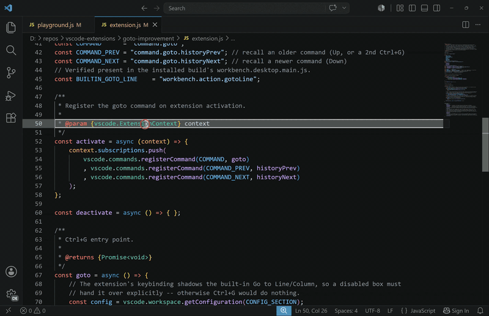 |

| `d%` -- delete to the matching bracket | `v%` -- select to the matching bracket |
| --- | --- |
| 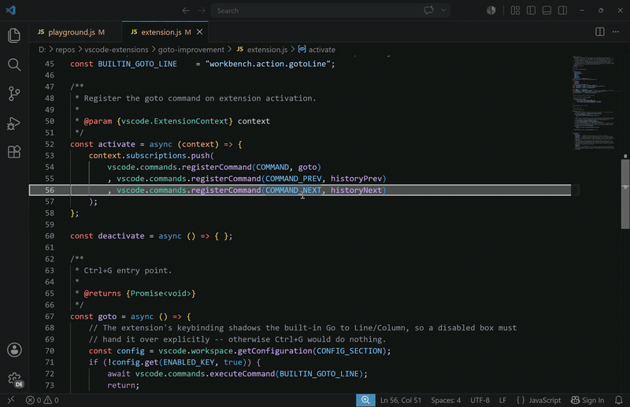 | 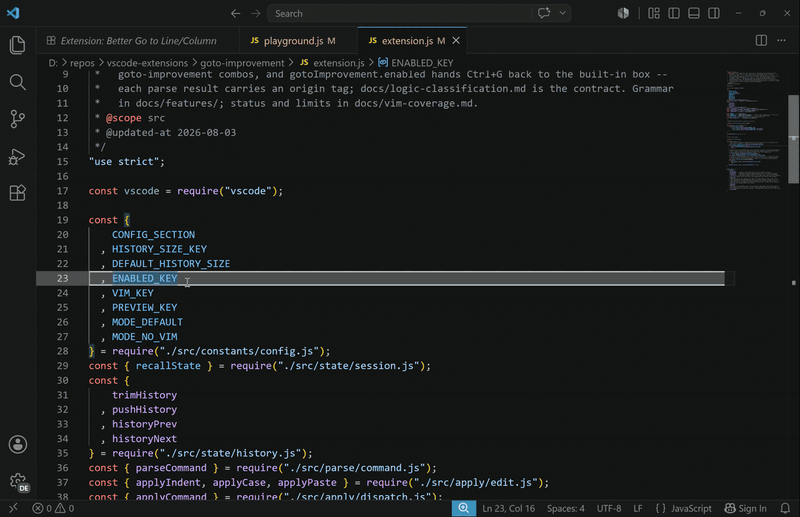 |

| `/pattern` -- jump to the next match | `Up` / `Down` -- recall a previous command |
| --- | --- |
| 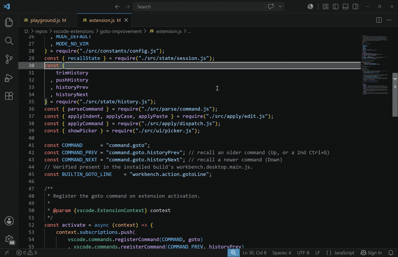 | 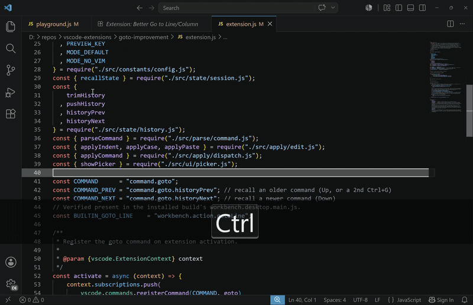 |

## Settings

| Setting | Default | What it does |
| ------- | ------- | ------------ |
| `betterGoto.enabled` | `true` | Off gives `Ctrl+G` back to the built-in Go to Line/Column. |
| `betterGoto.vim` | `true` | Off keeps only `42`, `42:5`, `+n` / `-n`, `N%`. |
| `betterGoto.preview` | `true` | Off keeps the editor still while you type. |
| `betterGoto.historySize` | `10` | Commands recalled with `Up` / `Down`. `0` turns history off. |

### Preview

| `betterGoto.preview` on (default) | `betterGoto.preview` off |
| --- | --- |
| 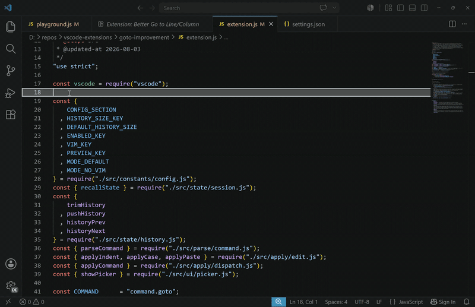 | 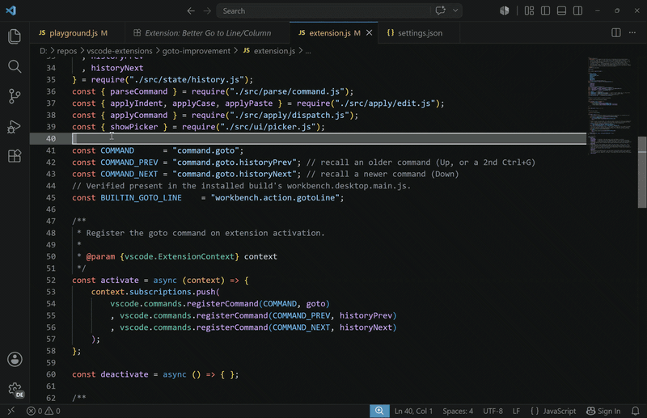 |

## Keybinding

`Ctrl+K Ctrl+S`, search **Better Go to**, *Change Keybinding*. Or in `keybindings.json`:

```jsonc
[
  // free Ctrl+G -> back to the built-in Go to Line/Column
  { "key": "ctrl+g", "command": "-betterGoto.open", "when": "!betterGoto.boxOpen" },
  // open this box somewhere else
  { "key": "ctrl+alt+g", "command": "betterGoto.open", "when": "!betterGoto.boxOpen" }
]
```

Command ids: `betterGoto.open`, `betterGoto.historyPrev`, `betterGoto.historyNext`.
Want the built-in back and nothing else? Set `betterGoto.enabled` to `false`.

## Cheat sheet

| Type | Result |
| ---- | ------ |
| `42` | line 42 |
| `42:5` | line 42, column 5 |
| `+10` / `-3` | 10 lines down / 3 up |
| `50%` | halfway through the file |
| `gg` / `G` | first / last line |
| `%` | the matching bracket |
| `/todo` | next match of "todo" |
| `v}` | **select** to the next blank line |
| `ciw` | **change** the word under the cursor |
| `:1,20sort` | sort lines 1 to 20 |

A count multiplies (`3j`, `2d3w`), and a doubled operator acts on the whole line (`dd`, `yy`,
`>>`). The box says where `Enter` will land before you press it.

## Reference

Everything below is what the box accepts -- the subset of Vim that fits a one-shot command box.
A Vim command that is not listed is not built; the reasons are under
[Not Vim, on purpose](#not-vim-on-purpose).

### Lines and file

| Type | Result |
| ---- | ------ |
| `42`, `:42` | line 42 |
| `gg` / `G` | first / last line. With a count: `2gg`, `5G` |
| `50%` | that percent of the file (`0%` is line 1, `100%` the last line) |
| `+5` / `-3` | 5 lines down / 3 up. Chains: `+5+5` is `+10` |
| `j` / `k` | one line down / up. `3j` for three. Arrow keys work too |
| `gj` / `gk` | one *screen* line down / up (differs from `j` / `k` when lines wrap) |
| `+` / `-` / `_` | N lines down / up, landing on the first non-blank. Count goes FIRST: `5+` |
| `H` / `M` / `L` | top / middle / bottom of the visible screen. `H` and `L` take a count |
| `go` | go to a byte offset (VS Code prompts for the number) |

### Within a line

| Type | Result |
| ---- | ------ |
| `42:5` | line 42, column 5. Also `+4:+4`, and chains like `+2:+2+2` |
| `0` / `$` | start / end of the line. `2$` is the end of the next line down |
| `^` / `g_` | first / last non-blank character |
| `g0` / `g^` / `g$` / `gm` | start / first non-blank / end / middle of the *screen* line |
| `h` / `l` | one character left / right. `5l` for five |
| `5\|` | column 5 |
| `gM` | the middle of the line. `90gM` for 90% across it |
| `fx` / `Fx` | jump forward / back to the next `x` on this line. `2fx` for the second |
| `tx` / `Tx` | same, but stop just before it |
| `;` / `,` | repeat the last `f`/`F`/`t`/`T` forwards / backwards |

### Words

| Type | Result |
| ---- | ------ |
| `w` / `b` / `e` | next word / previous word / end of word. All take a count |
| `W` / `B` / `E` | same, but a WORD is whitespace-delimited |
| `ge` / `gE` | backwards to the end of the previous word / WORD |

### Blocks and brackets

| Type | Result |
| ---- | ------ |
| `{` / `}` | previous / next blank line |
| `(` / `)` | previous / next sentence |
| `[[` / `]]` | previous / next section (a `{` in column 0) |
| `][` / `[]` | next / previous section end (a `}` in column 0) |
| `%` | the matching bracket |
| `[(` / `])` | previous / next unmatched `(` or `)` |
| `[{` / `]}` | previous / next unmatched `{` or `}` -- the start / end of the block |
| `[c` / `]c` | previous / next change (against the file's git baseline) |

### Text objects

Use them with an operator: `ciw`, `di(`, `yit`, `>ap`.

| Type | Result |
| ---- | ------ |
| `iw` / `aw` | inner / around word |
| `iW` / `aW` | inner / around WORD |
| `ip` / `ap` | inner / around paragraph |
| `i(` `i[` `i{` `i<` | inside the bracket pair. `a(` and friends include the brackets |
| `ib` / `iB` | same as `i(` / `i{` (Vim's synonyms); `ab` / `aB` likewise |
| `i"` `i'` ``i` `` | inside the quotes. `a"` includes them |
| `it` / `at` | inside / around an HTML or XML tag |

### Search

| Type | Result |
| ---- | ------ |
| `/pattern` | next match |
| `?pattern` | previous match |
| `n` / `N` | repeat the last search forwards / backwards |
| `*` / `#` | next / previous occurrence of the word under the cursor (whole word) |
| `g*` / `g#` | same, but match inside longer words too |
| `gn` / `gN` | select the next / previous match of the Find widget |
| `gd` / `gD` | go to the definition / declaration |
| `K` | show the hover for the word under the cursor |
| `gf` / `gF` / `[f` / `]f` | open the link under the cursor (a URL, or a path the language marks as a link) |

### Operators

| Prefix | Result |
| ------ | ------ |
| (none) | move the cursor |
| `v` | select charwise |
| `V` | select whole lines |
| `d` | delete |
| `c` | change -- deletes the range and leaves the cursor there (no Vim insert mode) |
| `y` | yank into the system clipboard |
| `>` / `<` | indent / outdent |
| `=` | reindent (VS Code's formatter) |
| `gu` / `gU` | lowercase / uppercase |
| `g~` | toggle case |
| `g?` | rot13 |
| `gq` / `gw` | reformat |
| `zf` | fold the range: `zfj`, `zfaw`, `zfip` |

Doubled forms act on the current line: `dd` `yy` `cc` `>>` `<<` `==` `guu` `gUU` `g~~` `g??`.

### Standalone commands

| Type | Result |
| ---- | ------ |
| `x` / `X` | delete the character under / before the cursor. `3x` for three |
| `D` / `C` / `Y` | delete / change / yank to end of line, or the whole line for `Y` |
| `J` / `gJ` | join lines, with / without a space |
| `~` | toggle the case of the character and move right. `3~` for three |
| `r{char}` | replace the character. `3rz` replaces three with `z` |
| `s` / `S` | substitute a character / the whole line |
| `a` / `i` / `gI` | append / insert / insert at column 1 |
| `o` / `O` | open a new line below / above and put the cursor there |
| `u` / `g-` / `g+` | undo / undo / redo |
| `gv` | expand the selection (Vim reselects the last visual area) |
| `ga` | print the character code, as Vim does |
| `gt` / `gT` | next / previous editor tab. `2gt` for the second tab |
| `ZZ` / `ZQ` | save and close / close without saving |

### Paste

The system clipboard is the register: anything `y`, `d` or `yy` put there pastes back, and so does
anything copied from another app. A yanked whole line pastes as a line.

| Type | Result |
| ---- | ------ |
| `p` / `P` | put after / before the cursor. `3p` for three copies |
| `gp` / `gP` | same, but leave the cursor past the new text |
| `]p` `[p` `]P` `[P` | put with the indent matched to the current line |

### Scrolling and folds

| Type | Result |
| ---- | ------ |
| `zt` / `zz` / `zb` | scroll the current line to the top / centre / bottom |
| `z.` / `z-` | like `zz` / `zb`, and move to the first non-blank |
| `z+` / `z^` | scroll the line just below / above the window into view |
| `zh` / `zl` | scroll the view left / right |
| `zo` `zO` `zc` `zC` `za` `zA` | open / close / toggle the fold at the cursor (capital = recursive) |
| `zR` / `zM` | open / close every fold |
| `zn` / `zN` / `zi` / `zX` | open every fold / close every fold (Vim's fold-enable switches) |
| `zr` / `zm` | fold level up / down one. `3zm` works |
| `zj` / `zk` | move to the next / previous fold |
| `zv` | open just enough folds to show the cursor line |
| `zF` / `zE` / `zd` / `zD` | fold the selection / remove every manual fold / remove the fold(s) at the cursor |

### Ex commands

Type `:` first. Long spellings work too (`:write`, `:quit`, `:tabnext`, `:bnext` ...).

| Type | Result |
| ---- | ------ |
| `:42` / `:$` | line 42 / last line |
| `:w` `:wa` `:q` `:q!` `:qa` `:wq` `:x` `:wqa` `:e!` | save / save all / close / discard and close / close all / save and close / save all and close all / reload |
| `:undo` / `:redo` (`:u`, `:red`, `:earlier`, `:later`) | undo / redo |
| `:sp` / `:vs` / `:new` / `:vne` / `:ene` | split down / right; split and open a new editor; new empty editor |
| `:clo` / `:on` | close the editor / keep only this editor |
| `:tabe` `:tabc` `:tabo` `:tabn` `:tabp` `:tabfir` `:tabl` | new / close / close others / next / previous / first / last editor |
| `:bn` `:bp` `:bf` `:bl` `:bd` | next / previous / first / last editor, close editor (Vim's buffer wording) |
| `:se` / `:set` | open VS Code Settings |
| `:isp` | reveal the definition in a side editor |

With a `[range]`:

| Type | Result |
| ---- | ------ |
| `:1,5d` / `:1,5y` | delete / yank lines 1 to 5 |
| `:1,5j` | join them |
| `:1,5>` / `:1,5<` | indent / outdent them |
| `:1,5sort` | sort them |
| `:1,5m20` / `:1,5t20` (`:co`) | move / copy them to after line 20 |
| `:%s/old/new/g` | substitute across the file; `:s/old/new/` on the current line |

Addresses: a number, `.` (current line), `$` (last line), `%` (whole file), `N,M`. No range means
the current line. `:s` flags: `g` (every match on the line) and `i` (ignore case).

## Not Vim, on purpose

One command, one `Enter`, the box closes. So:

- No dot-repeat, macros, marks, or a visual *mode* -- `v` / `V` select in one shot.
- `:s` takes `g` and `i` only (use `Ctrl+H` to confirm each). Patterns are JavaScript regex.
- `c` deletes the range and leaves the cursor there. There is no insert mode.
